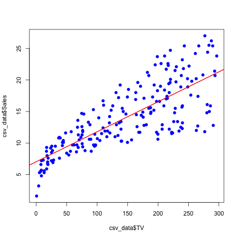

## Abstract

In this report, we reproduce the main results displayed in section 3.1 *Simple Linear Regression* (chapter 3) of the book *[An Introduction to Statistical Learning](http://www-bcf.usc.edu/~gareth/ISL/)*.

## Introduction

The overall goal is to provide advice on how to improve sales of the particular product. More specifically, we are assessing the relationship between advertising and sales. If the analysis shows that there is an association between advertising and sales, we will develop a model to predict sales based on advertising budgets.


## Data

The [advertising dataset](http://www-bcf.usc.edu/%7Egareth/ISL/Advertising.csv) consists of Sales(in thousands of units) of a particular product in 200 different markets, along with advertising budgets (in thousands of dollars) for the product in each of those markets for three different media (TV, Newspaper and Radio). We will focus on TV budget in this report.

## Methodology

Since we are studying the relationship between _Sales_ and a single media _TV_, we will try to use a simple linear model:

$Sales = \beta_0 + \beta_1TV$

To estimate two coefficients $\beta_0$ and $\beta_1$, we fit the linear regression model via the least square criterion.

## Results
We compute the regression coefficients in Table 1 below:

```{r, echo=FALSE, results='asis'}
load(file = "../data/regression.RData")
sum <- summary(reg)
library(xtable)
table1 <- xtable(sum, caption = "Table 1: Information about Regression Coefficients")
print(table1, comment=FALSE, type = "html")
```

As we can see in Table 1, we have a slope of 0.0475, a positive number which suggests that the more budget we put in TV advertising, the more sales we get. Also, we notice that the p values are nearly 0, which means that it would be extremely rare to get a result as unusual as this if the coefficient were really 0.

More information about the least squares model is given in the table below:

```{r results='asis', echo=FALSE}
load(file = "../data/regression.RData")
s <- summary(reg)
sum_table_quantities <- c("Residual standard error", "R Squared", "F-Statistics")
sum_table_values <- c(s$sigma, s$r.squared, s$fstatistic[1])
sum_table_df <- data.frame(sum_table_quantities, sum_table_values)
colnames(sum_table_df) <- c("Quantity", "Value")
table2 <- xtable(sum_table_df, caption = "Table 2: Regression Quality Indicies")
print(table2, comment=FALSE, type = "html")
```

As we can see in Table 2, for our model, residual standard error is 3.26 and R-squared value is 0.61, which is not super high. It indicates that the data is kind of close to the fitted line but our may not be the best model. It suggests that we should try other linear models in the future work.

Below is the scatterplot with fitted regression line. And we can see that as budget for TV advertising increases, the deviation between data and fitted regression line also increases, which also suggests that our model performs worse when TV advertising budget gets large.



## Conclusions
Our simple linear regression model with least square criterion perform OK with our current dataset. However, it may not be reliable when the budget is really high. We should gather more data to train our model. Also we should explore other models for comparison and maybe introduce ensemble method for better quality.
